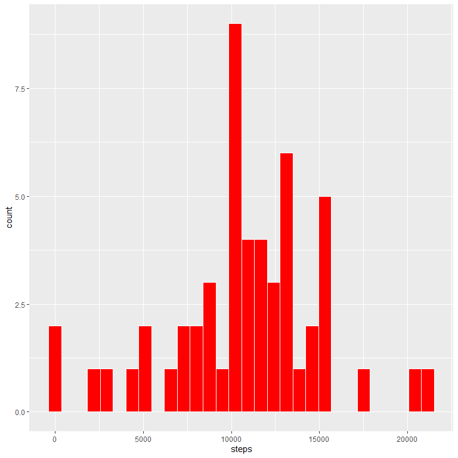
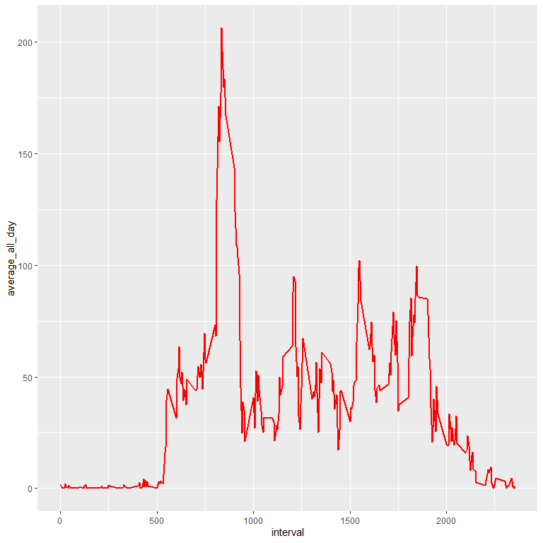
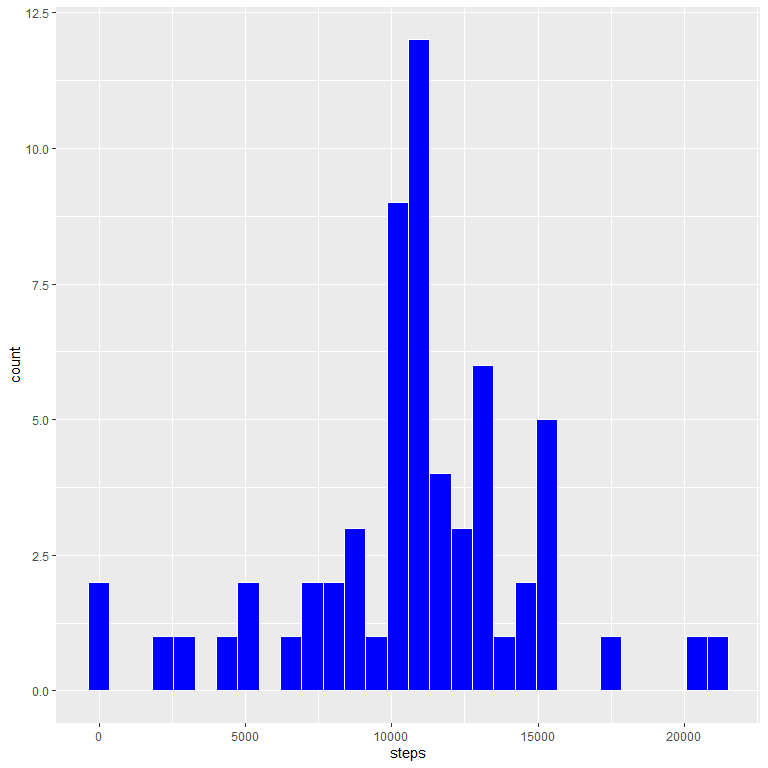
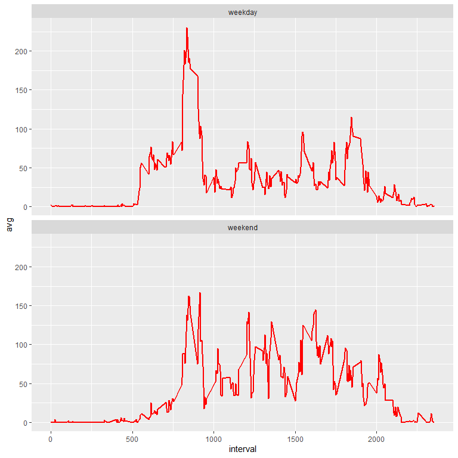

## Loading and preprocessing the data 
### 1.Code for reading in the dataset and/or processing the data
**Load the package we need**

```r
library(knitr)
library(tidyverse)  #including dplyr ggplot2
```

```
## -- Attaching packages ------------------------------------------------------------------------------------------------- tidyverse 1.3.0 --
```

```
## √ ggplot2 3.3.0     √ purrr   0.3.3
## √ tibble  3.0.1     √ dplyr   0.8.5
## √ tidyr   1.0.3     √ stringr 1.4.0
## √ readr   1.3.1     √ forcats 0.5.0
```

```
## -- Conflicts ---------------------------------------------------------------------------------------------------- tidyverse_conflicts() --
## x dplyr::filter() masks stats::filter()
## x dplyr::lag()    masks stats::lag()
```


**Set echo value to TRUE so that we can show both the code chunk and the results**

```r
knitr::opts_chunk$set(echo = TRUE)
```


**Let's unzip the "activity.zip" file and read the data**

```r
#unzip("activity.zip")
data <- read.csv("activity.csv")
```
  


## What is mean total number of steps taken per day?

### 2.Histogram of the total number of steps taken each day
**Calculate the total number of steps taken per day**

```r
total_steps_perday <- data %>%filter(!is.na(steps))%>% group_by(date) %>% summarise_each(sum,steps)
head(total_steps_perday)
```

```
## # A tibble: 6 x 2
##   date       steps
##   <fct>      <int>
## 1 2012-10-02   126
## 2 2012-10-03 11352
## 3 2012-10-04 12116
## 4 2012-10-05 13294
## 5 2012-10-06 15420
## 6 2012-10-07 11015
```

**Create the histogram**

```r
ggplot(total_steps_perday,mapping = aes(x= steps)) +geom_histogram(fill = "Red",color = "White",bins = 30)
```

<!-- -->

### 3.Mean and median number of steps taken each day
**Calculate and report the mean and median of the total number of steps taken per day**

```r
summarise(total_steps_perday,mean = mean(steps),median = median(steps))
```

```
## # A tibble: 1 x 2
##     mean median
##    <dbl>  <int>
## 1 10766.  10765
```


## What is the average daily activity pattern?
### 4.Time series plot of the average number of steps taken

```r
data %>% filter(!is.na(steps)) %>%group_by(interval) %>% 
    summarise(average_all_day = mean(steps)) %>% 
    ggplot(mapping = aes(x = interval,y = average_all_day))+
    geom_line(color = "red",size = 1)
```

<!-- -->

### 5.The 5-minute interval that, on average, contains the maximum number of steps


```r
avg_frame <- data %>% filter(!is.na(steps)) %>%group_by(interval) %>% 
    summarise(average_all_day = mean(steps)) 

avg_frame[which(avg_frame$average_all_day == max(avg_frame$average_all_day)),]$interval
```

```
## [1] 835
```

## Imputing missing values

### 6.Code to describe and show a strategy for imputing missing data


```r
#Calculate and report the total number of missing values in the dataset 
#(i.e. the total number of rows with NAS)
#2304 NAs
summary(data)
```

```
##      steps                date          interval     
##  Min.   :  0.00   2012-10-01:  288   Min.   :   0.0  
##  1st Qu.:  0.00   2012-10-02:  288   1st Qu.: 588.8  
##  Median :  0.00   2012-10-03:  288   Median :1177.5  
##  Mean   : 37.38   2012-10-04:  288   Mean   :1177.5  
##  3rd Qu.: 12.00   2012-10-05:  288   3rd Qu.:1766.2  
##  Max.   :806.00   2012-10-06:  288   Max.   :2355.0  
##  NA's   :2304     (Other)   :15840
```


```r
#Devise a strategy for filling in all of the missing values in the dataset. 
#The strategy does not need to be sophisticated.
#For example, you could use the mean/median for that day, or the mean for that 5-minute interval, etc.

#Using the mean for that 5-minute interval

mean_steps_perinterval <- data %>% group_by(interval) %>% summarise(mean_value = mean(steps,na.rm = TRUE))


#Create a new dataset that is equal to the original dataset but with the missing data filled in.
new_data <- data

for (i in 1:nrow(new_data))
{
    if (is.na(new_data$steps[i]))
    {
        new_data$steps[i] <- 
            mean_steps_perinterval[which(new_data$interval[i] == mean_steps_perinterval$interval),]$mean_value
        
        #print(mean_steps_perinterval[which(new_data$interval[i] == mean_steps_perinterval$interval),]$mean_value)
    }
}


summary(new_data)
```

```
##      steps                date          interval     
##  Min.   :  0.00   2012-10-01:  288   Min.   :   0.0  
##  1st Qu.:  0.00   2012-10-02:  288   1st Qu.: 588.8  
##  Median :  0.00   2012-10-03:  288   Median :1177.5  
##  Mean   : 37.38   2012-10-04:  288   Mean   :1177.5  
##  3rd Qu.: 27.00   2012-10-05:  288   3rd Qu.:1766.2  
##  Max.   :806.00   2012-10-06:  288   Max.   :2355.0  
##                   (Other)   :15840
```

```r
sum(is.na(new_data))
```

```
## [1] 0
```

### 7.Histogram of the total number of steps taken each day after missing values are imputed

```r
#Make a histogram of the total number of steps taken each day and Calculate and report the mean and median total number of steps taken per day. Do these values differ from the estimates from the first part of the assignment? What is the impact of imputing missing data on the estimates of the total daily number of steps?

total_steps_perday2 <- new_data %>% filter(!is.na(steps))%>% group_by(date) %>% summarise_each(sum,steps)
ggplot(total_steps_perday2,mapping = aes(x= steps)) +geom_histogram(fill = "Blue",color = "White",bins = 30)
```

<!-- -->


```r
summarise(total_steps_perday2,mean = mean(steps),median = median(steps))
```

```
## # A tibble: 1 x 2
##     mean median
##    <dbl>  <dbl>
## 1 10766. 10766.
```

```r
#mean is same but median is greter
```


## Are there differences in activity patterns between weekdays and weekends?

**Create a new factor variable in the dataset with two levels – “weekday” and “weekend” indicating whether a given date is a weekday or weekend day.**

```r
Sys.setlocale("LC_TIME", "English")
```

```
## [1] "English_United States.1252"
```

```r
new_data <- new_data %>% mutate(week_day = weekdays(as.Date(date)),
                                week_day_or_not = ifelse(week_day %in% c("Monday","Tuesday","Wednesday","Thursday","Friday"),"weekday","weekend"))

summary(new_data)
```

```
##      steps                date          interval        week_day        
##  Min.   :  0.00   2012-10-01:  288   Min.   :   0.0   Length:17568      
##  1st Qu.:  0.00   2012-10-02:  288   1st Qu.: 588.8   Class :character  
##  Median :  0.00   2012-10-03:  288   Median :1177.5   Mode  :character  
##  Mean   : 37.38   2012-10-04:  288   Mean   :1177.5                     
##  3rd Qu.: 27.00   2012-10-05:  288   3rd Qu.:1766.2                     
##  Max.   :806.00   2012-10-06:  288   Max.   :2355.0                     
##                   (Other)   :15840                                      
##  week_day_or_not   
##  Length:17568      
##  Class :character  
##  Mode  :character  
##                    
##                    
##                    
## 
```


### 8.Panel plot comparing the average number of steps taken per 5-minute interval across weekdays and weekends


```r
new_data %>% group_by(week_day_or_not,interval) %>% summarise(avg = mean(steps)) %>% ggplot(mapping = aes(interval,avg)) + geom_line(color = "Red",size = 1) +facet_wrap(~week_day_or_not,nrow = 2,ncol = 1)
```

<!-- -->


### 9.All of the R code needed to reproduce the results (numbers, plots, etc.) in the report (above)

